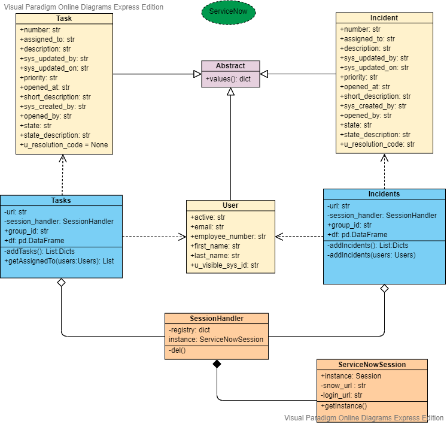

# DataEngineering-JIRA-ServiceNow

This is the JIRA-ServiceNow repository, this is considering a module of a larger project, for best software engineering practices the project was broken down into different modules. 

The JIRA-ServiceNow module establishes a connection through a REST API to a ServiceNow account, in this case the application extracts data (Task & Incidents) that happened to be modified in the last 48 hrs. The data is retrieving in a JSON format, then the data is cleaned and transformed to a Pandas DataFrame, the application is also extracting User information that latter on is also transformed to a Pandas DataFrame and joined with the other data set, the result is a csv that is pushed to a Cloud Storage bucket (Google Cloud Platform) that triggers the next module (Cloud Function).

This module is being trigger by a GCP Cloud Scheduler cron job.

Object Oriented Programming Class diagram


   
### Objective

> Enhance the current process that runs on EC2 with a better
> and robust solution 100% Serverless.

### Tech

List of technologies used for this module

* Cloud Scheduler
* Cloud Function (Python 3.7)
* Cloud Storage
* Cloud Source Repositories (Mirror GitHub)

### Local Testing

Requires [Python](https://docs.conda.io/en/latest/miniconda.html) v3.7+ to run.

Install the dependencies

```sh
$ cd DataEngineering-JIRA-ServiceNow
$ conda create -n venv python=3.7
$ conda activate venv
$ pip install -r requirements.txt
$ python main_test_locally.py
```
Note: To run locally deactivate python decorators and add your own ServiceNow credentials.


#### Building for source
if new lib added to the project update requirements.txt
```sh
$ pip freeze --local > requirements.txt
```

### Docker
GCP builds the container therefore the requirements.txt needs to be provided

```sh
FROM python:3.7-alpine
FROM python:3.7-slim-buster
WORKDIR /code
COPY requirements.txt requirements.txt
RUN pip install --no-cache-dir -r requirements.txt
COPY . .
CMD [ "python", "./main_test_locally.py" ]
```

### Todos

 - 
 - 
 
## Authors
* **Luis Fuentes** - *2020-06-30*
* **Daniel Steinemann** - *2020-06-30*
* **Angel Angel** - *2020-06-30*